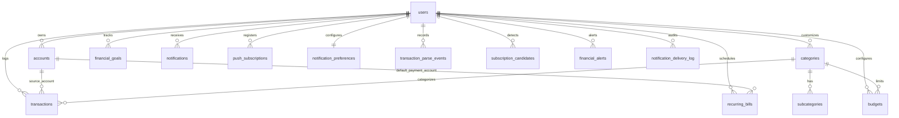

# EXPENSE TRACKER PRO 2.0 - DATABASE ARCHITECTURE
**Document Version:** 2.0.0-PROD  
**Database Engines:** PostgreSQL 16+ (Render Cloud Production) / SQLite 3 (Local Development)  
**Schema Definition:** 16 Relational Tables  

---

## 1. ENTITY RELATIONSHIP DIAGRAM (TOPOLOGICAL SEQUENCE)



---

## 2. TABLE SPECIFICATIONS & SCHEMA DICTIONARY

### 1. `users`
Core user identity, cryptographic authentication, and security credentials.
- `id`: `SERIAL / INTEGER PRIMARY KEY`
- `name`: `TEXT NOT NULL`
- `email`: `TEXT NOT NULL UNIQUE`
- `password`: `TEXT NOT NULL` (PBKDF2 / SHA-256 hash)
- `phone`: `TEXT`
- `is_verified`: `INTEGER DEFAULT 0`
- `otp_code`: `TEXT`
- `otp_expires_at`: `TIMESTAMP` (10-minute expiry)
- `login_otp_code`: `TEXT`
- `login_otp_expires_at`: `TIMESTAMP`
- `app_pin`: `TEXT` (Salted SHA-256 hash)
- `is_pin_enabled`: `INTEGER DEFAULT 0`
- `privacy_mode`: `INTEGER DEFAULT 0`
- `currency_code`: `TEXT DEFAULT 'INR'`
- `currency_symbol`: `TEXT DEFAULT '₹'`
- `created_at`: `TIMESTAMP DEFAULT CURRENT_TIMESTAMP`

### 2. `accounts`
Financial accounts, wallets, credit cards, and bank ledgers.
- `id`: `SERIAL / INTEGER PRIMARY KEY`
- `user_id`: `INTEGER NOT NULL REFERENCES users(id) ON DELETE CASCADE`
- `name`: `TEXT NOT NULL` (e.g. "HDFC Salary", "Cash Wallet")
- `account_type`: `TEXT NOT NULL` (`CASH`, `BANK`, `CREDIT_CARD`, `SAVINGS`, `OTHER`)
- `initial_balance`: `NUMERIC(14, 2) NOT NULL DEFAULT 0.0`
- `current_balance`: `NUMERIC(14, 2) NOT NULL DEFAULT 0.0`
- `credit_limit`: `NUMERIC(14, 2) DEFAULT 0.0`
- `color_hex`: `TEXT DEFAULT '#4F46E5'`
- `icon`: `TEXT DEFAULT 'wallet'`
- `is_active`: `INTEGER NOT NULL DEFAULT 1`
- `created_at`: `TIMESTAMP DEFAULT CURRENT_TIMESTAMP`

### 3. `categories`
Top-level spending and income categorization.
- `id`: `SERIAL / INTEGER PRIMARY KEY`
- `user_id`: `INTEGER REFERENCES users(id) ON DELETE CASCADE` (NULL for global system defaults)
- `name`: `TEXT NOT NULL`
- `type`: `TEXT NOT NULL CHECK(type IN ('EXPENSE', 'INCOME'))`
- `icon`: `TEXT DEFAULT 'tag'`
- `color_hex`: `TEXT DEFAULT '#6B7280'`
- `is_default`: `INTEGER DEFAULT 0`
- `created_at`: `TIMESTAMP DEFAULT CURRENT_TIMESTAMP`

### 4. `subcategories`
Granular classification within top-level categories.
- `id`: `SERIAL / INTEGER PRIMARY KEY`
- `category_id`: `INTEGER NOT NULL REFERENCES categories(id) ON DELETE CASCADE`
- `name`: `TEXT NOT NULL`
- `created_at`: `TIMESTAMP DEFAULT CURRENT_TIMESTAMP`

### 5. `transactions`
Unified double-entry transaction ledger.
- `id`: `SERIAL / INTEGER PRIMARY KEY`
- `user_id`: `INTEGER NOT NULL REFERENCES users(id) ON DELETE CASCADE`
- `account_id`: `INTEGER NOT NULL REFERENCES accounts(id) ON DELETE CASCADE`
- `target_account_id`: `INTEGER REFERENCES accounts(id) ON DELETE SET NULL` (For transfers)
- `category_id`: `INTEGER REFERENCES categories(id) ON DELETE SET NULL`
- `subcategory_id`: `INTEGER REFERENCES subcategories(id) ON DELETE SET NULL`
- `transaction_type`: `TEXT NOT NULL CHECK(transaction_type IN ('EXPENSE', 'INCOME', 'TRANSFER'))`
- `amount`: `NUMERIC(14, 2) NOT NULL`
- `date`: `VARCHAR(10) NOT NULL` (YYYY-MM-DD)
- `note`: `TEXT`
- `receipt_url`: `TEXT`
- `client_uuid`: `TEXT` (Offline idempotent sync)
- `created_at`: `TIMESTAMP DEFAULT CURRENT_TIMESTAMP`

### 6. `expenses`
Legacy mirror table maintained for backward compatibility.
- `id`: `SERIAL / INTEGER PRIMARY KEY`
- `user_id`: `INTEGER NOT NULL REFERENCES users(id) ON DELETE CASCADE`
- `category`: `TEXT NOT NULL`
- `amount`: `NUMERIC(14, 2) NOT NULL`
- `date`: `VARCHAR(10) NOT NULL`
- `notes`: `TEXT`
- `created_at`: `TIMESTAMP DEFAULT CURRENT_TIMESTAMP`

### 7. `budgets`
Monthly spending caps by overall user budget or specific category.
- `id`: `SERIAL / INTEGER PRIMARY KEY`
- `user_id`: `INTEGER NOT NULL REFERENCES users(id) ON DELETE CASCADE`
- `category_id`: `INTEGER REFERENCES categories(id) ON DELETE CASCADE` (NULL for overall)
- `month`: `INTEGER NOT NULL CHECK(month BETWEEN 1 AND 12)`
- `year`: `INTEGER NOT NULL`
- `amount`: `NUMERIC(14, 2) NOT NULL`
- `created_at`: `TIMESTAMP DEFAULT CURRENT_TIMESTAMP`

### 8. `recurring_bills`
Subscriptions, scheduled bills, and automated loan EMIs.
- `id`: `SERIAL / INTEGER PRIMARY KEY`
- `user_id`: `INTEGER NOT NULL REFERENCES users(id) ON DELETE CASCADE`
- `account_id`: `INTEGER REFERENCES accounts(id) ON DELETE SET NULL`
- `category_id`: `INTEGER REFERENCES categories(id) ON DELETE SET NULL`
- `title`: `TEXT NOT NULL`
- `amount`: `NUMERIC(14, 2) NOT NULL`
- `frequency`: `TEXT NOT NULL DEFAULT 'MONTHLY'` (`WEEKLY`, `MONTHLY`, `YEARLY`)
- `due_day`: `INTEGER NOT NULL`
- `next_due_date`: `VARCHAR(10) NOT NULL`
- `auto_paid`: `INTEGER DEFAULT 0`
- `is_active`: `INTEGER DEFAULT 1`
- `created_at`: `TIMESTAMP DEFAULT CURRENT_TIMESTAMP`

### 9. `financial_goals`
Target savings milestones with account-linked contribution tracking.
- `id`: `SERIAL / INTEGER PRIMARY KEY`
- `user_id`: `INTEGER NOT NULL REFERENCES users(id) ON DELETE CASCADE`
- `title`: `TEXT NOT NULL`
- `target_amount`: `NUMERIC(14, 2) NOT NULL`
- `current_amount`: `NUMERIC(14, 2) NOT NULL DEFAULT 0.0`
- `target_date`: `VARCHAR(10)`
- `color_hex`: `TEXT DEFAULT '#10B981'`
- `icon`: `TEXT DEFAULT 'target'`
- `is_completed`: `INTEGER DEFAULT 0`
- `created_at`: `TIMESTAMP DEFAULT CURRENT_TIMESTAMP`

### 10. `notifications`
In-app notifications and alert feeds.
- `id`: `SERIAL / INTEGER PRIMARY KEY`
- `user_id`: `INTEGER NOT NULL REFERENCES users(id) ON DELETE CASCADE`
- `type`: `TEXT NOT NULL CHECK(type IN ('WARNING', 'DANGER', 'INFO', 'SUCCESS'))`
- `title`: `TEXT NOT NULL`
- `message`: `TEXT NOT NULL`
- `category_id`: `INTEGER`
- `action_route`: `TEXT`
- `is_read`: `INTEGER DEFAULT 0`
- `created_at`: `TIMESTAMP DEFAULT CURRENT_TIMESTAMP`

### 11. `push_subscriptions`
Browser Web Push endpoints and encryption keys.
- `id`: `SERIAL / INTEGER PRIMARY KEY`
- `user_id`: `INTEGER NOT NULL REFERENCES users(id) ON DELETE CASCADE`
- `endpoint`: `TEXT NOT NULL UNIQUE`
- `p256dh`: `TEXT`
- `auth`: `TEXT`
- `created_at`: `TIMESTAMP DEFAULT CURRENT_TIMESTAMP`

### 12. `notification_preferences`
User granular notification delivery opt-in/opt-out settings.
- `user_id`: `INTEGER PRIMARY KEY REFERENCES users(id) ON DELETE CASCADE`
- `budget_80`: `INTEGER DEFAULT 1`
- `budget_100`: `INTEGER DEFAULT 1`
- `bill_due`: `INTEGER DEFAULT 1`
- `security_alerts`: `INTEGER DEFAULT 1`
- `forecast`: `INTEGER DEFAULT 1`
- `goals`: `INTEGER DEFAULT 1`
- `weekly_summary`: `INTEGER DEFAULT 1`
- `unusual_spending`: `INTEGER DEFAULT 1`
- `all_off`: `INTEGER DEFAULT 0`
- `updated_at`: `TIMESTAMP DEFAULT CURRENT_TIMESTAMP`

### 13. `transaction_parse_events`
Audit log for SMS, clipboard, and receipt OCR parsing operations.
- `id`: `SERIAL / INTEGER PRIMARY KEY`
- `user_id`: `INTEGER NOT NULL REFERENCES users(id) ON DELETE CASCADE`
- `source_type`: `TEXT NOT NULL` (`SMS`, `CLIPBOARD`, `OCR`)
- `raw_text`: `TEXT`
- `parsed_data_json`: `TEXT`
- `confidence`: `TEXT` (`HIGH`, `MEDIUM`, `LOW`, `NONE`)
- `status`: `TEXT DEFAULT 'PENDING'` (`PENDING`, `CONFIRMED`, `DISCARDED`)
- `created_at`: `TIMESTAMP DEFAULT CURRENT_TIMESTAMP`

### 14. `subscription_candidates`
Discovered recurring charges detected from transaction history.
- `id`: `SERIAL / INTEGER PRIMARY KEY`
- `user_id`: `INTEGER NOT NULL REFERENCES users(id) ON DELETE CASCADE`
- `title`: `TEXT NOT NULL`
- `amount`: `NUMERIC(14, 2) NOT NULL`
- `frequency`: `TEXT DEFAULT 'MONTHLY'`
- `last_charged_date`: `VARCHAR(10)`
- `confidence`: `TEXT`
- `status`: `TEXT DEFAULT 'PENDING'` (`PENDING`, `CONVERTED`, `IGNORED`)
- `created_at`: `TIMESTAMP DEFAULT CURRENT_TIMESTAMP`

### 15. `financial_alerts`
Deterministic rules engine alert log with 24-hour deduplication.
- `id`: `SERIAL / INTEGER PRIMARY KEY`
- `user_id`: `INTEGER NOT NULL REFERENCES users(id) ON DELETE CASCADE`
- `alert_type`: `TEXT NOT NULL`
- `severity`: `TEXT NOT NULL` (`INFO`, `WARNING`, `DANGER`)
- `title`: `TEXT NOT NULL`
- `message`: `TEXT NOT NULL`
- `supporting_metric`: `TEXT`
- `is_read`: `INTEGER DEFAULT 0`
- `created_at`: `TIMESTAMP DEFAULT CURRENT_TIMESTAMP`

### 16. `notification_delivery_log`
Push delivery audit tracking HTTP status codes and dead subscriptions.
- `id`: `SERIAL / INTEGER PRIMARY KEY`
- `user_id`: `INTEGER NOT NULL REFERENCES users(id) ON DELETE CASCADE`
- `endpoint`: `TEXT`
- `payload_json`: `TEXT`
- `status`: `TEXT` (`SENT`, `FAILED_410_PRUNED`, `SKIPPED_PREFERENCE`)
- `created_at`: `TIMESTAMP DEFAULT CURRENT_TIMESTAMP`

---

## 3. INDEX STRATEGY & QUERY OPTIMIZATION

```sql
CREATE INDEX IF NOT EXISTS idx_users_email ON users(email);
CREATE INDEX IF NOT EXISTS idx_accounts_user ON accounts(user_id);
CREATE INDEX IF NOT EXISTS idx_categories_user ON categories(user_id, type);
CREATE INDEX IF NOT EXISTS idx_transactions_user_date ON transactions(user_id, date);
CREATE INDEX IF NOT EXISTS idx_transactions_account ON transactions(account_id);
CREATE INDEX IF NOT EXISTS idx_transactions_type ON transactions(user_id, transaction_type);
CREATE UNIQUE INDEX IF NOT EXISTS idx_transactions_uuid ON transactions(user_id, client_uuid) WHERE client_uuid IS NOT NULL;
CREATE INDEX IF NOT EXISTS idx_budgets_user_period ON budgets(user_id, month, year);
CREATE UNIQUE INDEX IF NOT EXISTS idx_budgets_unique_overall ON budgets (user_id, month, year) WHERE category_id IS NULL;
CREATE UNIQUE INDEX IF NOT EXISTS idx_budgets_unique_cat ON budgets (user_id, category_id, month, year) WHERE category_id IS NOT NULL;
CREATE INDEX IF NOT EXISTS idx_goals_user ON financial_goals(user_id);
CREATE INDEX IF NOT EXISTS idx_bills_user ON recurring_bills(user_id);
CREATE INDEX IF NOT EXISTS idx_notifications_user ON notifications(user_id, is_read);
CREATE INDEX IF NOT EXISTS idx_alerts_user ON financial_alerts(user_id, is_read);
CREATE INDEX IF NOT EXISTS idx_sub_cand_user ON subscription_candidates(user_id, status);
CREATE INDEX IF NOT EXISTS idx_parse_user ON transaction_parse_events(user_id);
CREATE INDEX IF NOT EXISTS idx_expenses_user_date ON expenses(user_id, date);
```
